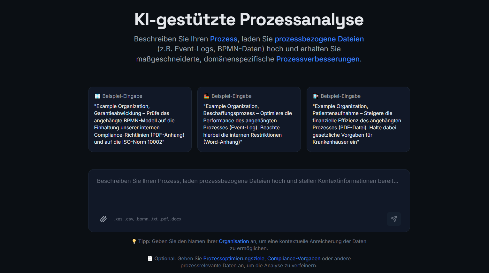
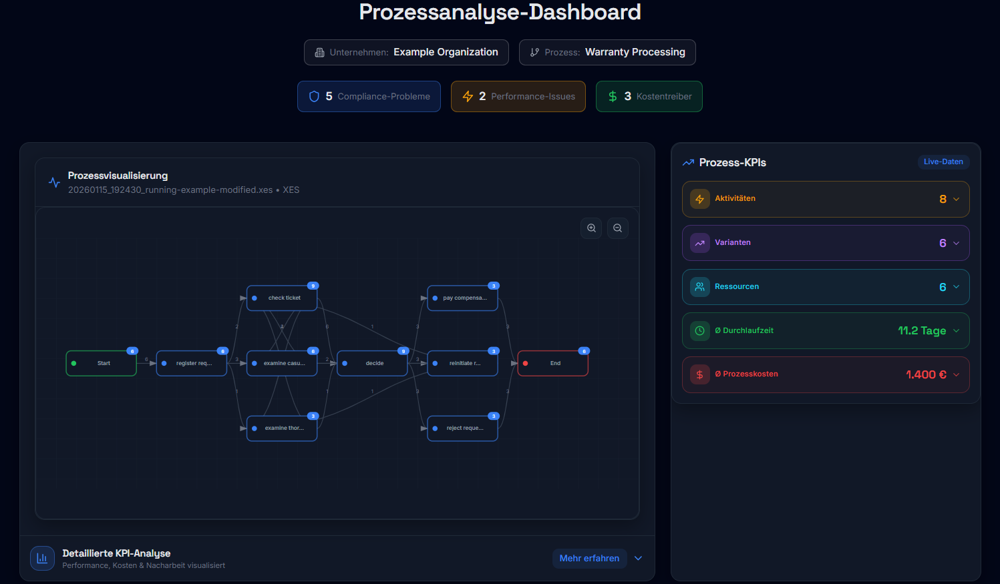
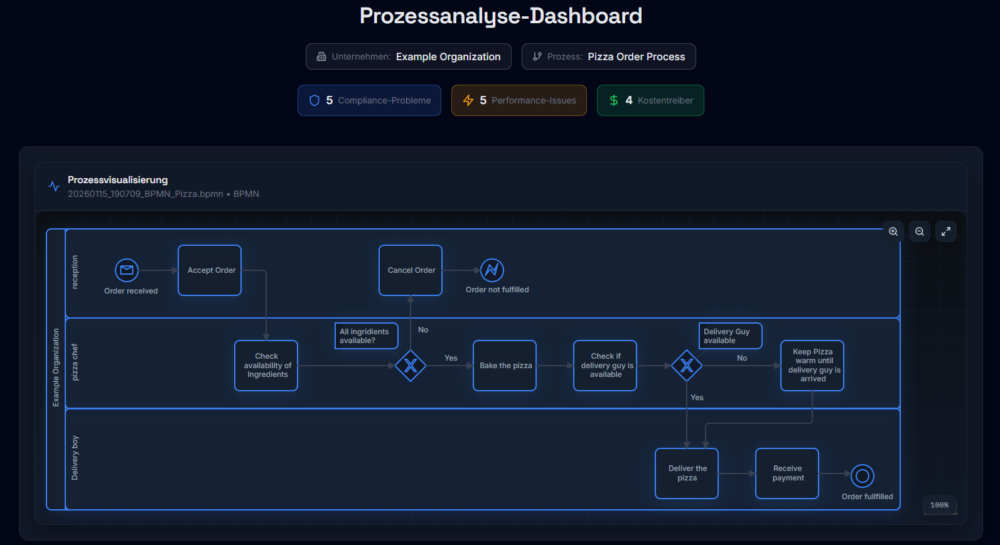
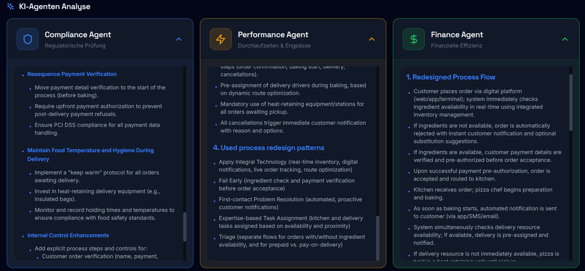
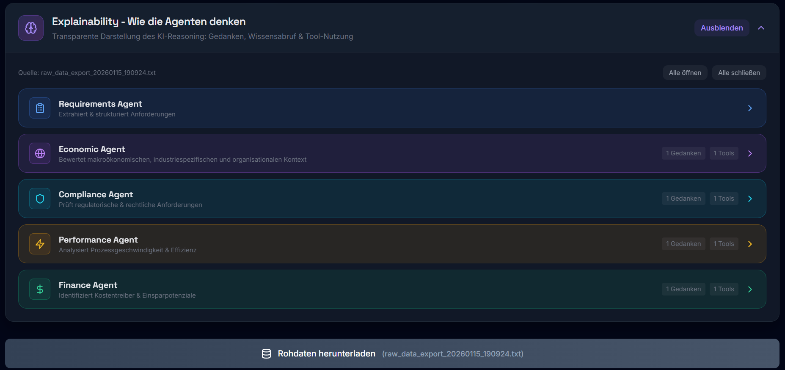

# 🤖 Multi-Agent System for automated Business Process Improvement 🤖

This repository contains a student project developed at the University of Bayreuth as part of the Software Project Seminar.

The goal of this project is to design and implement a **multi-agent system for automated business process improvement** using CrewAI. The software artifact enables users to upload **process information** (e.g. textual process descriptions, bpmn data, event logs) and **receive text-based process improvement and -redesign recommendations.**

The generated improvements focus on key process dimensions such as:

- Performance
- Finance
- Compliance

Feel free to explore the repository, experiment with the provided features, and adapthe project to your own needs. If you have any questions, suggestions, or feedback, please do not hesitate to get in touch with us 😃



---

## Table of Contents

- [Project Structure](#project-structure)
- [Requirements](#requirements)
- [Getting Started](#getting-started)
  - [Backend Setup](#backend-setup)
  - [Frontend Setup](#frontend-setup)
  - [Credentials Setup](#credentials-setup)
- [Running the System](#running-the-system)
  - [Terminal 1 - Start Backend manually](#terminal-1---start-backend-manually)
  - [Terminal 2 - Start Frontend manually](#terminal-2---start-frontend-manually)
  - [Access to System](#access-to-system)
  - [Troubleshooting](#troubleshooting)
- [System Workflow](#system-workflow)
  - [Input](#input)
    - [Input best practices](#input-best-practices)
    - [Input processing - structured data](#input-processing---structured-data)
    - [Input processing - unstructured data](#input-processing---unstructured-data)
  - [Agent Crew](#agent-crew)
    - [Requirements Agent](#requirements-agent)
    - [Economic Context Agent](#economic-context-agent)
    - [Performance Agent](#performance-agent)
    - [Finance Agent](#finance-agent)
    - [Compliance Agent](#compliance-agent)
  - [System Output](#system-output)
  - [System Limitations](#system-limitations)
    - [API Limitations](#api-limitations)
- [References](#references)
- [Contact](#contact)

---

## Project Structure

```
swps_ai_agents_for_bpi/
├── .venv                                   # Virtual Environment (automatically created after the setup)
├── backend/                                # Backend of the System
│   ├── etl/                                # ETL-Pipeline
│   |   ├── extract.py                      # Methods for extracting structured and unstructured data
│   │   ├── load.py                         # Initial Methods for loading the Input Data into PostgreSQL
│   |   ├── pipeline.py                     # Methods for starting the ETL-Process
│   |   └── transform.py                    # Methods for transforming strucured data into a coherent format
│   ├── process_analysis_engine/            # Processing of event logs
│   |    ├── analysis_utils.py              # Methods for calculating process KPI's from event logs
│   |    └── analysis_workflow.py           # Methods for structuring calculated process KPI's for agents
│   ├── ai_analysis.py                      # Script for connecting Frontend, ETL-Pipeline, Process Analysis Engine and Crew-Agents
│   ├── app.py                              # API for connecting Frontend and Backend
│   ├── clean_terminal_logs.py              # Methods for cleaning the terminal of agent-ouptuts
│   ├── explainability_extractor.py         # Methods for extracting data for UI-Explainability-Section
│   ├── process_visualization.py            # Visualizing Process via Directly-Follows Graphs and BPMN models
│   └── test_ai_analysis.py                 # File for enabling testing and logging of AI Agents     
├── frontend/                               # React Frontend
│   ├── src/                                # Main Frontend Code
│   ├── package.json                        # Node.js Dependencies
│   └── node_modules/                       # Node Dependencies (automatically created after the setup)
├── image/README                            # Preview pictures of the Frontend for README
│── knowledge/
│    └── process_redesign_patterns.json     # 52 process redesign pattern in JSON Format as agent knowledge source
│── src/swps_ai_agents_for_bpi/
│    ├── config/
│    │    ├── agents.yaml                   # Agent definitions (roal, goal, backstory)
│    │    └── tasks.yaml                    # Task definitions (description, expected output)
│    ├── crew.py                            # Crew definition (agents, tasks, tools, knowledge)
│    └── main.py                            # Running the Crew with inputs
│── tests/                                  # Test files
│── uploads/                                # Upload Directory
├── .env.example                            # Example .env file (rename and modify it with your credentials)
├── .gitignore                              # Files and directories to be ignored by git  
├── pyproject.toml                          # Required packages and dependencies
├── README.md                               # This file
└── uv.lock                                 # Detailed file of required packages and dependencies
```

---

## Requirements

Before you begin, ensure that the following software is installed on your system:

**Required Software**:

1. **3.10 <= Python < 3.14**

   ```bash
   python3 --version
   ```
2. **Node.js (v18+)** and **npm**

   ```bash
   node --version
   npm --version
   ```
3. **Git** (to clone the repository)

   ```bash
   git --version
   ```
4. **uv** (for dependency management and package handling)

   ```bash
   uv --version
   ```

---

## Getting Started

#### Clone the repository

```bash
git clone https://github.com/LPSchirmer/swps_ai_agents_for_bpi.git
```

---

### Backend Setup

#### 1. Create a virtual environment

```bash
uv venv
```

#### 2. Install all dependencies and packages

```bash
uv sync
```

---

### Frontend Setup

#### 1. Navigieren Sie zum Frontend-Verzeichnis

```bash
cd frontend
```

#### 2. Installieren Sie die Node.js-Dependencies

```bash
npm install
```

Dies installiert alle in `package.json` definierten Abhängigkeiten:

**Haupt-Dependencies:**

- react (^18.3.1)
- react-dom (^18.3.1)
- lucide-react (^0.344.0)
- axios (^1.6.7)

**Dev-Dependencies:**

- @vitejs/plugin-react (^4.2.1)
- vite (^7.1.7)
- typescript (^5.9.3)
- tailwindcss (^3.4.17)
- postcss (^8.4.35)
- autoprefixer (^10.4.17)
- eslint und Plugins

---

### Credentials Setup

Rename the .env.example file to .env and add your API keys accordingly.
In general, any model can be used; however, this project was tested using GPT-4.1.

You are responsible for managing and securing your API keys.

Add the following entries to your .env file:

BASE_MODEL_OPENAI: The OpenAI model to be used

API_KEY_OPENAI: Your OpenAI API key

CHROMA_OPENAI_API_KEY: Use the same OpenAI API key as above

SERPER_API_KEY: Obtain an API Key from [Serper](https://serper.dev/) (includes 2,500 free requests)

---

## Running the System

### Terminal 1 - Start Backend manually

```bash
.venv\Scripts\activate
cd backend
python app.py
```

### Terminal 2 - Start Frontend manually

```bash
cd frontend
npm run dev
```

---

### Access to System

After successful start:

- **Frontend:** http://localhost:5173
- **Backend API:** http://localhost:5001
- **Backend Health Check:** http://localhost:5001/api/health

---

### Troubleshooting

#### Problem: "Port already in use"

**Backend (Port 5001):**

```bash
# Prozess finden
lsof -i :5001
# Prozess beenden
kill -9 <PID>
```

**Frontend (Port 5173):**

```bash
# Prozess finden
lsof -i :5173
# Prozess beenden
kill -9 <PID>
```

#### Problem: "Cannot find module" im Frontend

```bash
cd frontend
rm -rf node_modules package-lock.json
npm install
```

#### Problem: CORS-Fehler

Stellen Sie sicher, dass:

- Das Backend läuft (`flask_cors` installiert ist)
- Die Frontend-Anfragen an `http://localhost:5001` gehen
- Im Backend `CORS(app)` aktiviert ist

#### Problem: Python-Version

Stellen Sie sicher, dass Sie Python 3.10+ verwenden:

```bash
python3 --version
```

Falls eine ältere Version installiert ist, aktualisieren Sie Python oder verwenden Sie `pyenv`:

```bash
# Mit Homebrew (macOS)
brew install python@3.13
```

---

## System Workflow

### Input

The system accepts both unstructured and structured process data.

Unstructured inputs include:

- Text entered directly into the frontend text field
- .docx files
- .txt files
- .pdf files

The unstructured data may include, for example, textual process descriptions, process optimization goals, internal compliance constraints, process KPIs, company-specific information, and more.

In addition to unstructured data, the following structured input formats are supported:

- .xes for event logs
- .csv for event logs
- .bpmn

**Event Log Requirements:**
Event logs must contain the following mandatory columns:

- Case ID
- Activity
- Timestamp

For enhanced analysis, the following optional columns are recommended:

- Resource
- Costs

---

### Input best practices

As a best practice, the company name should always be provided, as it enables the enrichment of relevant contextual information. Supplying event logs is strongly recommended, since they are essential for analyzing processes and calculating meaningful process KPIs. Clearly defined process optimization goals help to focus the analysis and improve the quality of the results. Overall, providing comprehensive and high-quality input data leads to better insights and more effective process optimization outcomes.

---

### Input processing - Unstructured Data

Unstructured data is extracted from the uploaded files, parsed, and passed to the Requirements Agent as plain text.

---

### Input processing - Structured Data

#### Event Logs

Event logs in XES or CSV format are first processed by our ETL pipeline. Subsequently, the Process Analysis Engine calculates process-relevant KPIs, which are then provided as input to the respective agents depending on the domain.

#### BPMN Data

BPMN data is simulated and processed as simulated event logs. These simulated event logs are used as input for the Requirements Agent.

---

### Agent-Crew

#### Requirements Agent

Once the input has been processed, the **Requirements Agent** is initiated. It structures the unstructured input into a JSON format, enabling the subsequent agents to continue working with the prepared and standardized information.

---

#### Economic Context Agent

Subsequently, the **Economic Context Agent** enriches the input data on an external level based on the provided company name. It incorporates macroeconomic data, industry-specific insights, and company-specific information that are relevant for informed process redesign and optimization.

---

#### Performance Agent

The **Performance Agent** receives the structured input data, the externally enriched information, and, if an event log is provided, the performance related KPIs. It further enriches these data in a layered manner similar to an onion model to incorporate deeper insights, such as best practices for the given process within the specific industry obtained via web searches.

Using this enriched dataset in combination with its knowledge repository, a collection of 52 process redesign patterns stored in JSON format, the Performance Agent generates textual process improvement recommendations and redesign options. Its focus is exclusively on improving the performance of the process.

---

#### Finance Agent

The **Finance Agent** receives the structured input data, the externally enriched information, and, if an event log is provided, the finance related KPIs. It further enriches these data in a layered manner similar to an onion model to incorporate deeper insights, such as best practices for the given process within the specific industry obtained via web searches.

Using this enriched dataset in combination with its knowledge repository, a collection of 52 process redesign patterns stored in JSON format, the Finance Agent generates textual process improvement recommendations and redesign options. Its focus is exclusively on improving the financial efficiency of the process.

---

#### Compliance Agent

The **Compliance Agent** receives the structured input data, the externally enriched information, and, if an event log is provided, the compliance related KPIs. When external standards or regulations are specified as input, the agent performs a deep search to identify and extract the most relevant information. Regardless of input, the agent always considers the given industry, organizational, and process context to identify potentially relevant regulations. The process is then evaluated against these standards. If internal compliance rules are provided, the process is also assessed against them. Finally, based on this evaluation and compliance analysis, the process is improved to ensure it is compliant.

---

### System Output

The system provides comprehensive outputs depending on the supplied input data:

**If an event log is provided:**

- The process is visualized as a directly-follows graph.
- Relevant process KPIs are calculated and visualized.



**If BPMN data is provided:**

- The process is visualized as a BPMN diagram.



**Provided independently of the input:**

- Textual process improvements and -redesigns generated by the Performance, Finance, and Compliance Agents.



- Agent explainability, including insights into the agents’ goals, tasks, reasoning processes and the tools they utilized.
- A complete execution log documenting the interactions and outputs of all agents involved.



---

### System Limitations

#### API Limitations

Our current OpenAI subscription (Plan 1) is limited to **30,000 tokens per minute (TPM)**.
Therefore, token usage within the codebase is restricted and optimized to stay within these API limits.

---

## References

ℹ️ We used the [process pattern app](https://process-pattern.app/) as collection of patterns for the crew's knowledge source

ℹ️ The agents are built using the [CrewAI framework](https://www.crewai.com/)

ℹ️ The Process Analysis Engine is largely based on the [pm4Py library](https://processintelligence.solutions/)

---

## Contact

For support, questions, or feedback regarding the repository, don't hesitate to contact us via E-Mail:

- Luca-Paul Schirmer: [lucapaulschirmer@gmail.com](mailto:lucapaulschirmer@gmail.com)
- Evgenij Krat: [evgenijkrat00@gmail.com](mailto:evgenijkrat00@gmail.com)
- Zi-Jun Ochsmann: [abc92112@gmail.com](mailto:abc92112@gmail.com)

🚀 **Have fun exploring our system and discovering the synergies between systematic process improvement and -redesign and the capabilities of AI agents** 🚀
